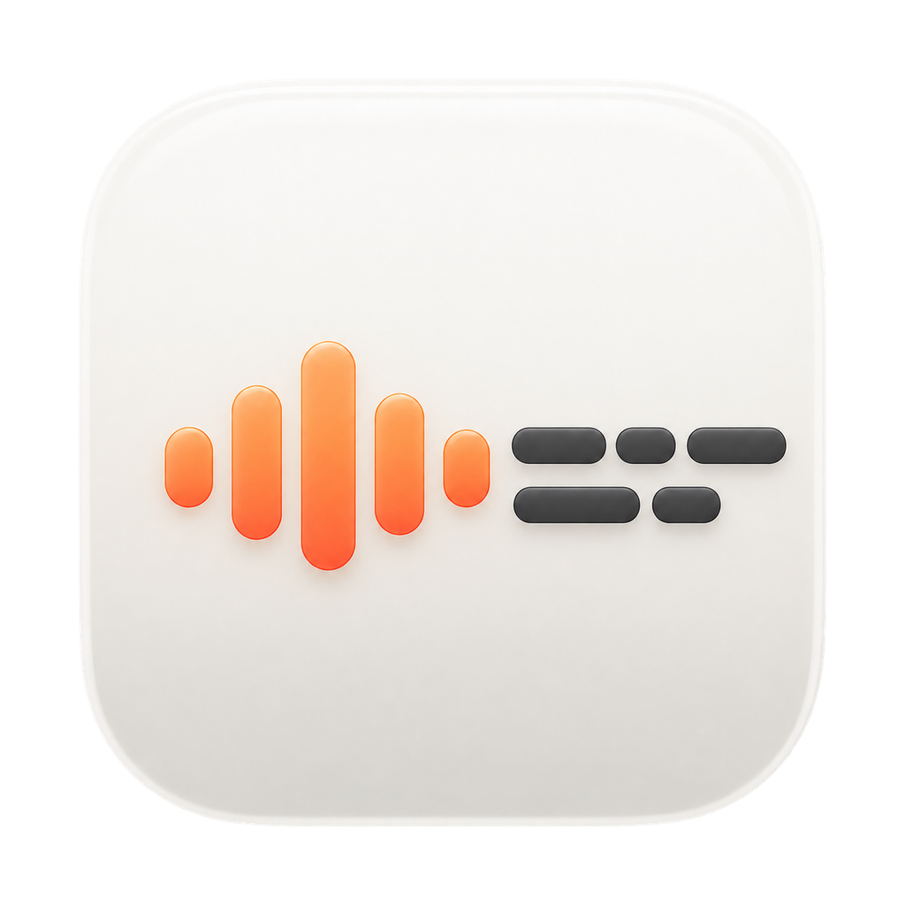
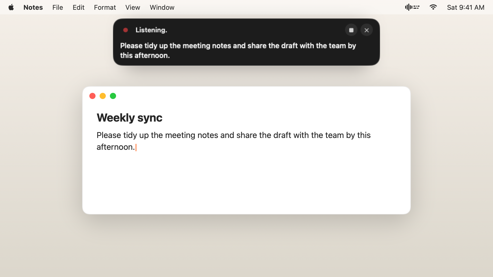
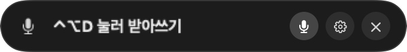
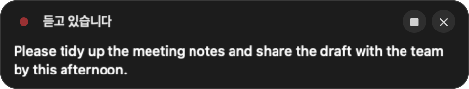
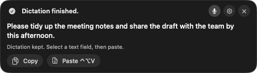
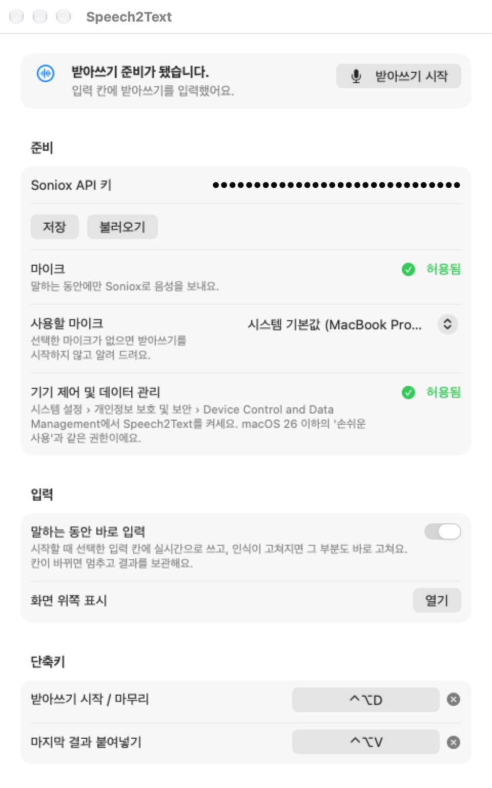

<p align="center">
  
</p>

<h1 align="center">Speech2Text</h1>

<p align="center">
  Native macOS dictation that types what you say into the field you're already in.
  <br>
  <b>English</b> · <a href="README-ko.md">한국어</a>
</p>

<p align="center">
  
</p>

Speech2Text is a menu bar app. Press a shortcut, speak, and your words appear in whatever text field you clicked, whether that's a terminal, a browser, or a notes app. A small overlay under the notch shows the live transcript. The app never reads your speech as commands and never rewrites it. It builds on the Soniox streaming transcription, audio conversion, and notch window structure from `Speech-to-action`.

## Language

The interface comes in English and Korean and follows your macOS language: System Settings › General › Language & Region, including a per-app language for Speech2Text under Applications. Any other language falls back to English. Restart the app after changing it.

## A look around

<table>
  <tr>
    <td width="56%" valign="top">
      <b>Idle</b>: one compact capsule under the notch<br><br>
      <br><br>
      <b>Listening</b>: the transcript updates live as you speak<br><br>
      <br><br>
      <b>Done</b>: the result stays until you dismiss it, with Copy and Paste for recovery<br><br>
      
    </td>
    <td width="44%" valign="top">
      <b>Settings</b>: API key, microphone, permissions, input, and shortcuts<br><br>
      <picture>
        <source media="(prefers-color-scheme: dark)" srcset="docs/images/settings-dark.png">
        
      </picture>
    </td>
  </tr>
</table>

## Build and run

Requires macOS 26 or later and Swift 6.2 or later.

```sh
cd ~/Documents/Speech2Text
bash scripts/build-app.sh
open build/Speech2Text.app
```

The build script uses the Command Line Tools (`DEVELOPER_DIR=/Library/Developer/CommandLineTools`) by default, so it works without accepting the Xcode license.

## Dictating

1. In Settings, paste your Soniox API key and press **Save**. The key is kept only in Speech2Text's own Keychain item (`com.speech2text.credentials`) and is loaded on the next launch. Pick a microphone under **Input Microphone**; the default is the system input.
2. Grant the Accessibility permission. macOS also asks for microphone access the first time you record.
3. **Click the text field** you want to type into first, in any app: terminal, browser, notes.
4. Press **Control+Option+D** (the default; see "Changing shortcuts" below) and speak. The overlay under the notch shows what's being recognized.
   - Recording starts as soon as the microphone is on, so you can talk right away. The Soniox connection finishes in the background, and the overlay shows "connecting" meanwhile. If the connection fails once, the app retries once automatically.
   - With no internet connection, the app refuses to start and tells you so immediately.
5. Text is typed into the field you picked as you speak. When recognition revises earlier words, only the changed tail is erased and retyped. Press the same shortcut or the finish button to settle on the final text. Recordings are limited to 60 seconds.
   - Standard Mac text fields (Notes, TextEdit, most apps) are edited through accessibility text replacement. Where that isn't supported, such as terminals, the app sends key events to that app only. This works with a Korean input method active.
   - If you switch to another field or app mid-way, live typing stops and the result is kept in the overlay. Cancelling erases only the text typed in this session. The app never sends newlines or Return.

Partial, still-changing transcripts are shown only in the overlay. The field receives the settled result, and the app never presses the Return key that would run a command in a terminal.

## Changing shortcuts

In Settings › **Shortcuts**, click an action's shortcut button and press the keys you want. Esc cancels recording, and ✕ turns that shortcut off.

- **Key chords**: a key pressed with at least one of ⌃, ⌥, or ⌘ (for example ⌃⌥D or ⌘⇧K), or F1–F20. Keys that would block typing (a letter with no modifier, or ⇧ plus a letter) aren't allowed.
- **Modifiers only**: pressing and releasing modifiers alone, such as both ⇧ keys together, the right ⌘ by itself, both ⌥ keys, or ⌘+⌥. Left and right are recorded separately. It doesn't count as a shortcut if you type another key or click while holding, or hold for longer than 0.6 seconds. This mode needs the device control (Accessibility) permission.
- **Multi-tap**: while recording, press the same key or modifier combination two or three times within 0.5 seconds to save it as a double or triple tap. If a single tap and a double tap of the same key are assigned to different actions, the single tap runs after a 0.5 second wait.

## When text wasn't typed

If you move to another app or field while speaking, automatic typing stops. The result stays in the overlay.

- **Copy**: copies the current dictation to the clipboard. Paste it with ⌘V wherever you like.
- **Paste** or **Control+Option+V**: sends it to the currently selected field. The overlay's buttons never take keyboard focus.
- For fields that don't support accessibility, copy and paste by hand.

Some apps don't report whether input succeeded. In that case the app shows **Paste requested** instead of claiming success. The default paste path replaces the clipboard contents with the dictation. Automatic typing isn't guaranteed to work in every third-party app.

## Input setup you finish yourself

Open the menu bar waveform icon → **Settings…** and set the following.

1. Under permissions, press **Request Access** for Accessibility, then **Open System Settings** and allow Speech2Text in the macOS list yourself. The app never changes permissions on its own.
2. Scroll down to **Input → Type While Speaking** to turn live typing on or off. When it's off, the transcript is kept and you copy or paste it when you choose.
3. Click the field you want, then use the overlay's **Paste** or **Control+Option+V**. To avoid the permission entirely, use **Copy** and press ⌘V yourself.

Permission status refreshes when you come back from System Settings. You enter passwords and approve macOS permissions yourself.

Depending on your macOS version, the relevant Privacy & Security item may be labelled **Device Control and Data Management**. That's different from the **Accessibility** screen in the sidebar that configures Zoom, VoiceOver, and so on.

Development builds with ad-hoc signing change their signature hash on every rebuild. If the list shows Speech2Text as enabled but the app still reports no permission, remove the old Speech2Text entry, add the **current `build/Speech2Text.app`** again, and allow it. Keep using that same build after approving.

## Data

Audio is sent to Soniox while recording, and Soniox usage charges apply. The key is never written to source or logs. Transcripts live only in memory and disappear when the app quits. The app doesn't save recordings or capture the screen.

## Local verification

```sh
bash scripts/test.sh
bash -n scripts/build-app.sh
bash scripts/build-app.sh
codesign --verify --deep --strict build/Speech2Text.app
```

With the Swift 6.4 Command Line Tools on this Mac, the default test command can't find the `TestingMacros`/`Testing` paths. `scripts/test.sh` passes the installed framework and macro paths explicitly and doesn't skip any tests. The current toolchain prints a deprecation warning for the `native` build backend.

You can also run a diagnostic that sends a real audio file through the same recognition path. Quit the app first.

```sh
open build/Speech2Text.app --args --audio-file /absolute/path/sample.aiff --no-auto-insert
```

This run also uses Soniox and the key in the app's own Keychain. Without `--no-auto-insert`, the result is typed automatically if the field that was focused at launch is still focused.

The built app is signed locally. Notarization, installing into Applications, launch at login, and GitHub Actions aren't set up.
